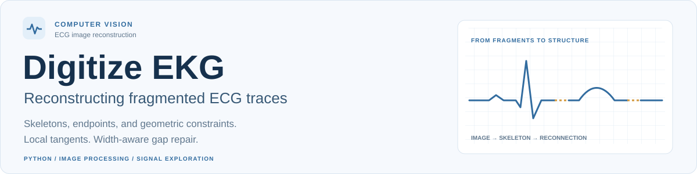
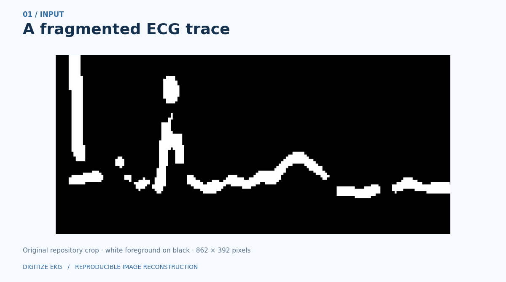
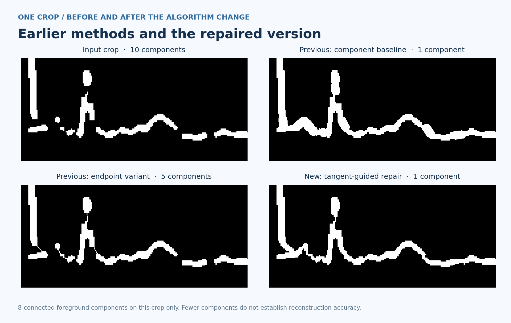
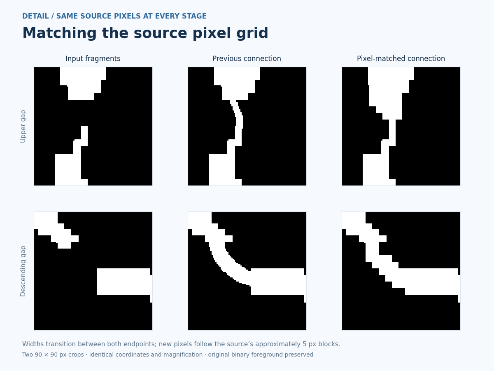
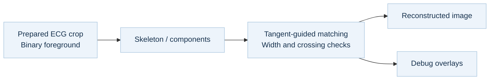

<p align="center">
  
</p>

<p align="center">
  
  
  
  
  
</p>

<p align="center">
  <a href="#the-project">The project</a> ·
  <a href="#see-the-reconstruction">Demo</a> ·
  <a href="#current-method-and-baselines">Methods</a> ·
  <a href="#run-the-example">Run the example</a>
</p>

## The project

**Digitize EKG explores how fragmented ECG image traces can be reconnected using classical computer vision.** The project focuses on a concrete reconstruction problem: identify disconnected trace geometry, propose connections, and inspect what each method adds to the image.

The work brings together three technical areas:

| Question | Approach | Inspectable output |
| --- | --- | --- |
| Where is the trace disconnected? | Binary image processing, skeletonization, and connected-component analysis. | Components, one-pixel skeletons, and detected endpoints. |
| Which fragments could connect? | Compare a component-distance baseline with endpoint and slope-aware methods. | Reconstructed masks under explicit pixel-scale parameters. |
| What changed, and where could it fail? | Color-coded endpoint debugging and side-by-side visual comparison. | Candidate bridges, iteration outputs, and connectivity counts. |

The current repair implementation is in [ecg_reconstruction.py](./ecg_reconstruction.py), with a runnable walkthrough in [signal_fixing.ipynb](./signal_fixing.ipynb). A companion [exploration notebook](./testing_and_development.ipynb) covers PTB-XL waveform loading, FFTs, spectrograms, image intensity analysis, and pixel calibration.

### How the current repair connects a gap

- Estimate outward directions from **local skeleton neighborhoods**, with stable end-cap alignment on straight traces.
- Pair endpoints from different components using distance and direction; allow at most one new connection per endpoint.
- Reject crossings and connections that would shortcut an already connected component.
- Draw **cubic connections that transition between both endpoint widths**.
- For block-scaled inputs, align new connections with the source's **pixel-block spacing and phase**. Merge only new pixels; the existing binary foreground stays intact.

The included crop has approximately 5-pixel blocks. The notebook estimates this display grid from repeated foreground edges; weak evidence leaves native pixel rendering in place. This matches image granularity, not physical time–voltage calibration.

## See the reconstruction



<sub>Generated from the repository's <a href="./result/example.png">example crop</a> and actual notebook functions. The animation follows the tangent-guided repair; amber marks its newly added pixels. Frames show stages, not elapsed runtime.</sub>

1. **Represent the trace:** threshold the prepared crop and skeletonize its foreground.
2. **Find candidates:** detect endpoints and identify nearby pairs.
3. **Inspect additions:** review the newly added pixels highlighted in amber.
4. **Repair and compare:** merge accepted connections, inspect the centerline, and compare with earlier methods.

## Current method and baselines



| Method | Implementation | What it explores |
| --- | --- | --- |
| **Current: tangent-guided repair** | Local direction estimates, endpoint matching, crossing checks, and cubic gap connections. | Preserve existing binary foreground while matching both endpoint widths and the source pixel grid. |
| **Component-distance baseline** | Find the nearest pixels between component pairs; connect pairs below a distance threshold. | How far connectivity alone can go. Newly added bridges are dilated using an estimated trace thickness. |
| **Row-wise geometric constraints** | Segment at blank rows, apply morphological closing, and score endpoint pairs by distance plus a slope penalty. | Restrict candidate bridges using horizontal direction, vertical displacement, and skeleton-intersection checks. |
| **Iterative endpoint variant** | Pair nearby unused endpoints, draw bridges, and rerun with increasing thresholds. | Make the connection process visible through debug overlays and intermediate images. |

On the included crop, the current repair adds **nine bridges**, reducing the number of foreground components from ten to one while preserving all original binary foreground pixels. The earlier component baseline also reaches one component, but its global thickness estimate adds much broader connectors. The earlier endpoint method leaves five components.

Connectivity alone does not establish waveform accuracy. The comparison shows the actual added geometry; [demo-metrics.json](./docs/assets/demo-metrics.json) records the component counts and preserved-input check, and [the bridge report](./docs/assets/demo/tangent-bridges.json) records each accepted connection.

### Pixel detail



Both close-ups use the same source coordinates and nearest-neighbor magnification. The earlier repair used the thinner endpoint width; the current repair meets both ends and keeps the source's coarse staircase edges. The [grid report](./docs/assets/demo/tangent-grid.json) records the estimated spacing and phase.

### Processing flow



## Run the example

Use **Python 3.11** and run these commands from the repository root:

```bash
git clone https://github.com/niccChen/digitize-ekg.git
cd digitize-ekg
python -m venv .venv
source .venv/bin/activate
python -m pip install -r requirements.txt
jupyter lab signal_fixing.ipynb
```

On Windows PowerShell, activate the environment with `.venv\Scripts\Activate.ps1`.

Choose **Run All Cells**. The notebook reads `result/example.png`, writes the current repair, its added-pixel mask and bridge report, plus the earlier baseline outputs and endpoint iterations to `outputs/signal-fixing/`, and displays a comparison. The included input is white on black. For a dark trace on a light background, form the foreground mask with `gray < 127` before calling `repair_trace`.

To execute without opening JupyterLab:

```bash
jupyter nbconvert --to notebook --execute signal_fixing.ipynb \
  --output signal-fixing.executed.ipynb --output-dir outputs
```

To rebuild the README figures after executing the notebook:

```bash
python scripts/build_demo.py
```

### Geometry regression checks

```bash
python -m unittest discover -s tests -v
```

Thirteen tests cover straight and curved traces, steep and reflected gaps, parallel traces, crossing obstruction, existing connections, long gaps, empty foreground, and invalid input. They also check unequal endpoint widths, coarse pixel-block alignment, grid-scale estimation, and weak-evidence fallback. These synthetic checks verify geometric behavior; broader waveform-fidelity evaluation needs reference signals.

### Explore the original waveform data

The reconstruction example runs entirely from files in this repository. The companion exploration notebook also uses external PTB-XL waveform records and `scp_statements.csv`.

Install `requirements-research.txt`, obtain those files from [PTB-XL on PhysioNet](https://physionet.org/content/ptb-xl/), and set the notebook's `path` to the dataset directory. See [data notes](./docs/DATA.md) for the distinction between waveform data, page images, and the prepared reconstruction crop.

## Current scope and next steps

- **Input preparation:** the demonstrated methods start with a prepared trace crop. Page deskewing, grid removal, and robust lead extraction would extend this into a full-page workflow.
- **Geometric reliability:** thresholds depend on image scale. Future evaluation should measure incorrect connections as well as missed gaps, with reference traces and a broader test set.
- **Numeric digitization:** current outputs are reconstructed image masks and debug views. Time–voltage calibration and one-dimensional waveform export remain next steps.
- **Evaluation:** the included run checks reproducibility and visible image structure. It does not establish clinical or diagnostic validity.

## Repository guide

| Path | Purpose |
| --- | --- |
| [ecg_reconstruction.py](./ecg_reconstruction.py) | Current tangent-guided gap repair. |
| [signal_fixing.ipynb](./signal_fixing.ipynb) | Main reconstruction notebook; start here. |
| [tests/](./tests/) | Synthetic geometry regression checks. |
| [testing_and_development.ipynb](./testing_and_development.ipynb) | Exploratory signal and image analysis. |
| [images/](./images/) | Four full-page ECG example images. |
| [result/](./result/) | Original prepared crops and historical result images. |
| [docs/assets/](./docs/assets/) | Reproducible walkthrough, method comparison, and project visuals. |
| [scripts/build_demo.py](./scripts/build_demo.py) | Build the presentation from actual notebook results. |
| `outputs/` | Local generated files; excluded from Git. |

## Data and acknowledgments

The exploration notebook uses the **PTB-XL** dataset: Wagner et al., *PTB-XL, a large publicly available electrocardiography dataset*, Scientific Data (2020). [Dataset publication](https://doi.org/10.1038/s41597-020-0495-6) · [PhysioNet data and terms](https://physionet.org/content/ptb-xl/).

Built with OpenCV, NumPy, scikit-image, SciPy, Matplotlib, and Jupyter. Data and visual provenance are documented in [data notes](./docs/DATA.md) and [asset credits](./docs/ASSETS.md).

---

<sub>Project by <a href="https://github.com/niccChen">Yiyun (Nicole) Chen</a>.</sub>
