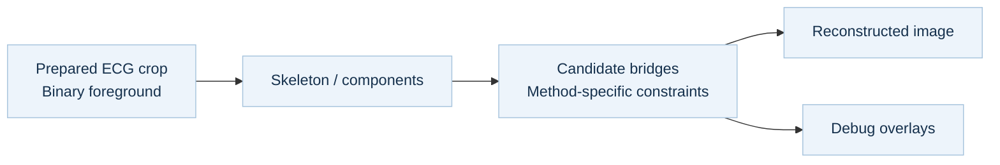

<p align="center">
  
</p>

<p align="center">
  
  
  
  
  
</p>

<p align="center">
  <a href="#the-project">The project</a> ·
  <a href="#see-the-reconstruction">Demo</a> ·
  <a href="#three-approaches">Methods</a> ·
  <a href="#run-the-example">Run the example</a>
</p>

## The project

**Digitize EKG explores how fragmented ECG image traces can be reconnected using classical computer vision.** The project focuses on a concrete reconstruction problem: identify disconnected trace geometry, propose connections, and inspect what each method adds to the image.

The work brings together three technical areas:

| Question | Approach | Inspectable output |
| --- | --- | --- |
| Where is the trace disconnected? | Binary image processing, skeletonization, and connected-component analysis. | Components, one-pixel skeletons, and detected endpoints. |
| Which fragments could connect? | Compare a component-distance baseline with endpoint and slope-aware methods. | Reconstructed masks under explicit pixel-scale parameters. |
| What changed, and where could it fail? | Color-coded endpoint debugging and side-by-side visual comparison. | Candidate bridges, iteration outputs, and connectivity counts. |

The main implementation is in [signal_fixing.ipynb](./signal_fixing.ipynb). A companion [exploration notebook](./testing_and_development.ipynb) covers PTB-XL waveform loading, FFTs, spectrograms, image intensity analysis, and pixel calibration.

## See the reconstruction


<sub>Generated from the repository's <a href="./result/example.png">example crop</a> and actual notebook functions. The animation follows the endpoint method; frames show processing stages, not elapsed runtime.</sub>

1. **Represent the trace:** threshold the prepared crop and skeletonize its foreground.
2. **Find candidates:** detect endpoints and identify nearby pairs.
3. **Inspect additions:** visualize endpoints and proposed connections.
4. **Iterate and compare:** merge bridges, then inspect the result alongside other methods.

## Three approaches


| Method | Implementation | What it explores |
| --- | --- | --- |
| **Component-distance baseline** | Find the nearest pixels between component pairs; connect pairs below a distance threshold. | How far connectivity alone can go. Newly added bridges are dilated using an estimated trace thickness. |
| **Row-wise geometric constraints** | Segment at blank rows, apply morphological closing, and score endpoint pairs by distance plus a slope penalty. | Restrict candidate bridges using horizontal direction, vertical displacement, and skeleton-intersection checks. |
| **Iterative endpoint variant** | Pair nearby unused endpoints, draw bridges, and rerun with increasing thresholds. | Make the connection process visible through debug overlays and intermediate images. |

On the included crop, the baseline produces one connected foreground component and the endpoint variant produces five after five passes. With its default settings, the constrained method performs morphological closing but adds no endpoint bridges on this example.

These are **8-connected component counts for one image**, not reconstruction-accuracy scores. The comparison makes a useful tradeoff visible: aggressive bridging improves connectivity while adding more geometry that needs review. Exact counts and runtime versions are recorded in [demo-metrics.json](./docs/assets/demo-metrics.json).

### Processing flow



## Run the example

Use **Python 3.11** and run these commands from the repository root:

```bash
git clone https://github.com/niccChen/digitize-ekg.git
cd digitize-ekg
python -m venv .venv
source .venv/bin/activate
python -m pip install -r requirements.txt
jupyter lab signal_fixing.ipynb
```

On Windows PowerShell, activate the environment with `.venv\Scripts\Activate.ps1`.

Choose **Run All Cells**. The notebook reads `result/example.png`, writes the three method outputs and endpoint iterations to `outputs/signal-fixing/`, and displays a comparison. The included input is white on black; use `invert=True` when calling a method on a dark trace with a light background.

To execute without opening JupyterLab:

```bash
jupyter nbconvert --to notebook --execute signal_fixing.ipynb \
  --output signal-fixing.executed.ipynb --output-dir outputs
```

To rebuild the README figures after executing the notebook:

```bash
python scripts/build_demo.py
```

### Explore the original waveform data

The reconstruction example runs entirely from files in this repository. The companion exploration notebook also uses external PTB-XL waveform records and `scp_statements.csv`.

Install `requirements-research.txt`, obtain those files from [PTB-XL on PhysioNet](https://physionet.org/content/ptb-xl/), and set the notebook's `path` to the dataset directory. See [data notes](./docs/DATA.md) for the distinction between waveform data, page images, and the prepared reconstruction crop.

## Current scope and next steps

- **Input preparation:** the demonstrated methods start with a prepared trace crop. Page deskewing, grid removal, and robust lead extraction would extend this into a full-page workflow.
- **Geometric reliability:** thresholds depend on image scale. Future evaluation should measure incorrect connections as well as missed gaps, with reference traces and a broader test set.
- **Numeric digitization:** current outputs are reconstructed image masks and debug views. Time–voltage calibration and one-dimensional waveform export remain next steps.
- **Evaluation:** the included run checks reproducibility and visible image structure. It does not establish clinical or diagnostic validity.

## Repository guide

| Path | Purpose |
| --- | --- |
| [signal_fixing.ipynb](./signal_fixing.ipynb) | Main reconstruction notebook; start here. |
| [testing_and_development.ipynb](./testing_and_development.ipynb) | Exploratory signal and image analysis. |
| [images/](./images/) | Four full-page ECG example images. |
| [result/](./result/) | Original prepared crops and historical result images. |
| [docs/assets/](./docs/assets/) | Reproducible walkthrough, method comparison, and project visuals. |
| [scripts/build_demo.py](./scripts/build_demo.py) | Build the presentation from actual notebook results. |
| `outputs/` | Local generated files; excluded from Git. |

## Data and acknowledgments

The exploration notebook uses the **PTB-XL** dataset: Wagner et al., *PTB-XL, a large publicly available electrocardiography dataset*, Scientific Data (2020). [Dataset publication](https://doi.org/10.1038/s41597-020-0495-6) · [PhysioNet data and terms](https://physionet.org/content/ptb-xl/).

Built with OpenCV, NumPy, scikit-image, SciPy, Matplotlib, and Jupyter. Data and visual provenance are documented in [data notes](./docs/DATA.md) and [asset credits](./docs/ASSETS.md).

---

<sub>Project by <a href="https://github.com/niccChen">Yiyun (Nicole) Chen</a>.</sub>
